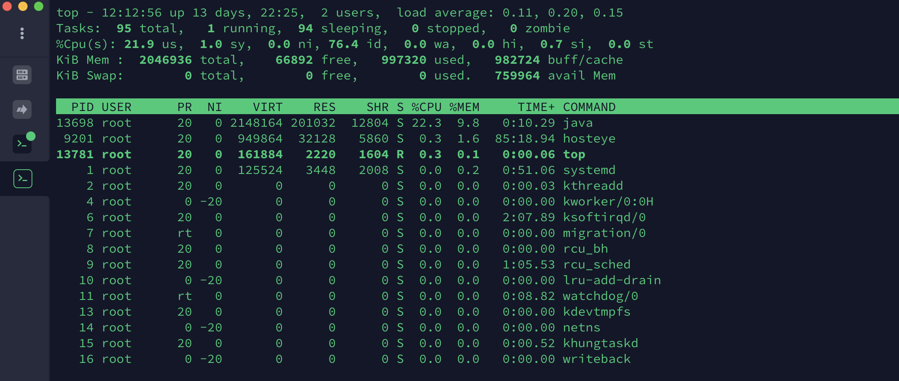
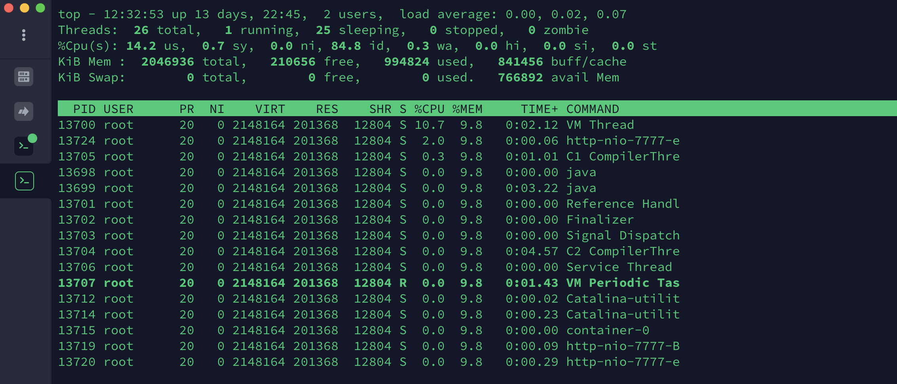
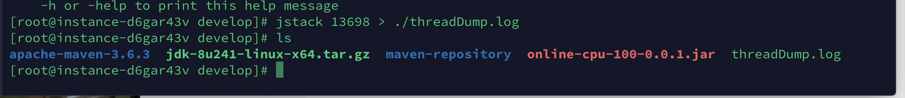
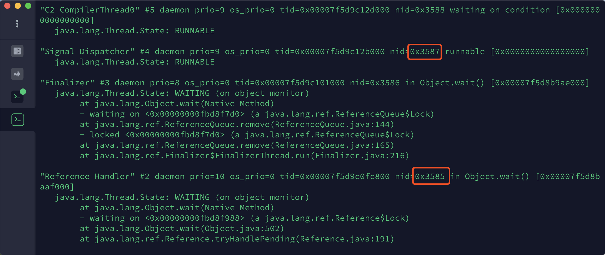

# 线上CPU使用100%解决示例

### 内存溢出
#### 查询占用资源最多的PID(进程)
```bash
top
```


如上图中PID为13697

#### 查看PID进程中,消耗CPU最多的线程
```bash
top -H -p pid编号(进程编号)
```


上图中是该进程中的所有线程列表，最高的则是消耗CPU最大

#### 保存线程堆栈信息
```bash
jstack 进程编号 > 保存本地文件
```


#### 查看堆栈信息定位问题
把最高的线程pid转换成16进制，并在堆栈信息中定位问题

